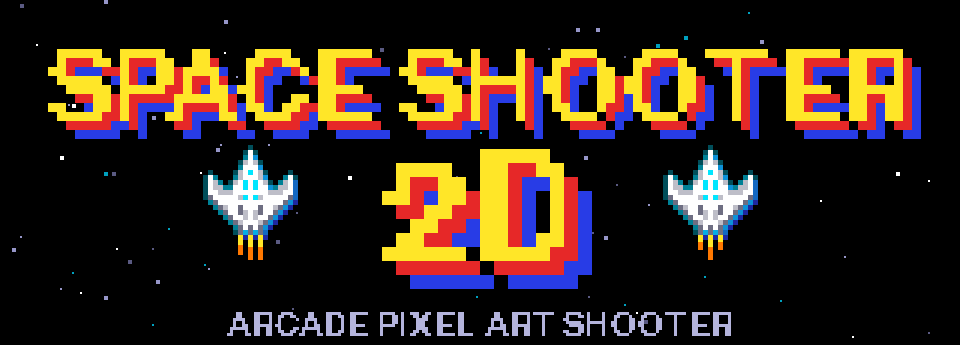

<p align="center">
  
</p>
<p align="center">
  Juego arcade de naves en pixel art hecho con <b>Python y Pygame</b>.<br>

  Esquiva los ataques de 8 tipos de alienígenas, mejora tu arma y sobrevive a 3 oleadas.
</p>
<p align="center">
  
  
  
 
## ✨ Características
 
- **8 tipos de aliens**, cada uno con su sprite, vida y patrón de ataque: recto, abanico, teledirigido, doble, onda sinusoidal, ráfaga, radial y apuntado al jugador (doble daño).
- **3 oleadas** con dificultad progresiva: los enemigos tienen más vida y disparan más rápido.
- **3 niveles de arma**: 1 cañón, 2 cañones y 3 cañones en abanico.
- **Sistema de vida** con 5 corazones (llenos, medios y vacíos) e invulnerabilidad breve tras recibir un golpe.
- **Efectos visuales**: partículas pixeladas (chispas, estelas, explosiones), brillo y llama del propulsor.
- **Audio retro 90s generado por código**: efectos de sonido, fanfarrias y música chiptune en bucle.
- **Sin dependencias pesadas**: solo requiere Pygame. No usa base de datos ni servicios en la nube.
## 🎮 Controles
 
| Acción | Control |
|---|---|
| Mover la nave | `W` `A` `S` `D` o flechas |
| Disparar | Clic izquierdo del mouse (mantener para ráfaga) |
| Cambiar arma | `1`, `2` o `3` |
| Iniciar / reiniciar | `ENTER` |
 
## ⚙️ Instalación y ejecución
 
Requisitos: **Python 3.10 o superior**.
 
```bash
# 1. Clona el repositorio
git clone https://github.com/kevinquispec-jpg/Space-Shoter-2D.git
cd Space-Shoter-2D
 
# 2. Instala Pygame
pip install pygame
 
# 3. Ejecuta el juego
python main.py
```
 
## 🧩 Cómo funciona
 
El juego usa una máquina de estados simple:
 
```
inicio → jugando → gameover / victoria → (ENTER) → jugando
```
 
Detalles técnicos que lo hacen funcionar bien:
 
- **Resolución y FPS:** 960 x 540 a 60 FPS, con `dt` limitado a 0.05 s para evitar saltos si baja el rendimiento.
- **Sprites en pixel art** creados a partir de cuadrículas de texto; la nave se dibuja a la mitad y se espeja.
- **Hitboxes reducidas** para que las colisiones se sientan justas.
- **Límite de 500 partículas** para mantener los FPS estables.
- **Movimiento diagonal normalizado** para que la nave no acelere en diagonal.
- **Sonido sintetizado** con ondas cuadradas, triángulo y ruido, protegido con `try/except` por si el equipo no tiene audio.
## 🗺️ Ideas futuras
 
- [ ] Puntuación y tabla de récords
- [ ] Power-ups (escudo, vida extra, arma temporal)
- [ ] Jefe final al terminar la oleada 3
- [ ] Más oleadas y modo infinito
- [ ] Menú de opciones (volumen, controles)
- [ ] Soporte para gamepad
## 🤖 Desarrollo
 
El proyecto nació como un laboratorio de Pygame asistido por IA generativa (Claude, de Anthropic) y continuó como proyecto personal. La IA ayudó a generar y depurar el código; las decisiones de diseño y los ajustes de jugabilidad fueron propios.
 
## 👤 Autor
 
**Kevin Alvin** — Estudiante de Ingeniería de Sistemas, apasionado por la ciberseguridad y el desarrollo de videojuegos.
Cochabamba, Bolivia · [GitHub](https://github.com/kevinquispec-jpg)
 
## 📄 Licencia
 
© 2026 Kevin Alvin Quispe Canaviri. Todos los derechos reservados.
 
Space Shooter 2D es un proyecto personal creado desde una idea y motivación, con dedicación como estudiante de Ingeniería de Sistemas.
 
🎮 ¡Juega!
 
🥳 ¡Diviértete!
 
⚔️ ¡Supera las oleadas! 👾
 
El código y los recursos son de mi autoría, así que puedes verlos pero no copiarlos ni modificarlos. Si tienes alguna idea para mejorar el juego, compártela conmigo a través de mi perfil de [GitHub](https://github.com/kevinquispec-jpg).